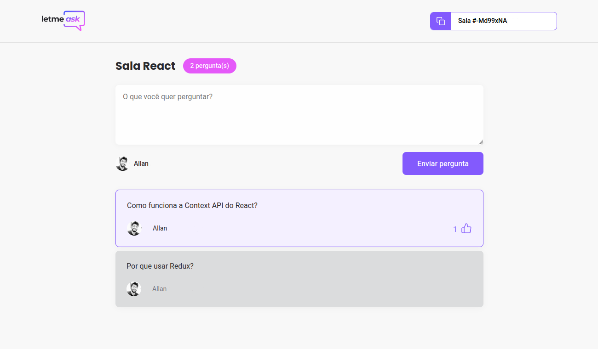

<h2 align="center">Let me Ask</h2>
<h4 align="center">A simple web application to help manage Q&A (questions and answers) during live streamings </h4>
 

  
  

### :computer: Languages and technologies:
  <ul style="list-style-type:round;">
    <li>Typescript</li>
    <li>ReactJS</li>
  </ul>

### :minidisc: Storage and authentication provider
  <ul style="list-style-type:round;">
  <li>Google <a href="https://firebase.google.com/">Firebase</a></li>
  </ul>

### Description
  The application allows the streamer to manage questions sent by viewers, highlighting, marking as answered or removing them. 
  Viewers can send questions and vote the questions they want to be answered.

### :memo: License
  This project is under MIT license. Check [LICENSE](LICENSE.md) for details.
 
<small>
  Built in the Next Level Week #6 event, by :rocket: [RocketSeat](https://rocketseat.com.br/), instructed by [Diego Fernandes](https://github.com/diego3g)
  </small>
